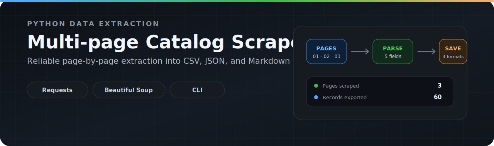
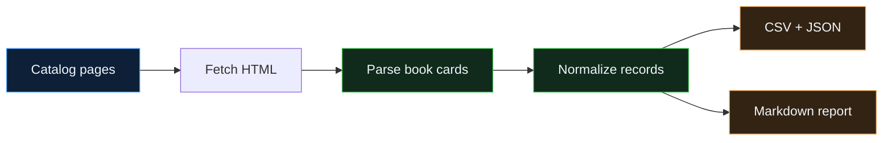

<div align="center">
  
</div>

<br>

<div align="center">

# Multi-page Catalog Scraper

**A modular Python CLI pipeline for extracting catalog data across multiple pages and exporting clean CSV, JSON, and Markdown outputs.**

[](https://www.python.org/)
[](https://requests.readthedocs.io/)
[](https://www.crummy.com/software/BeautifulSoup/)
[](#outputs)
[](#project-status)

[Overview](#overview) · [Pipeline](#pipeline) · [Usage](#usage) · [Outputs](#outputs) · [Reliability](#reliability)

</div>

---

## Overview

This project scrapes a configurable number of catalog pages, converts each book card into a stable record, and writes the collected data into three practical formats.

It uses [Books to Scrape](https://books.toscrape.com/), a public sandbox created for web-scraping practice, to demonstrate pagination, modular extraction, structured output, reporting, and graceful failure handling.

## Pipeline



## Highlights

| Capability | Implementation |
|---|---|
| **Multi-page extraction** | Scrapes a user-defined number of catalog pages |
| **Structured records** | Title, price, availability, rating, and absolute product URL |
| **Multiple outputs** | CSV, JSON, and generated Markdown report |
| **Configurable CLI** | Page count and custom output paths through `argparse` |
| **Resilient requests** | Timeout, HTTP status validation, and request-error handling |
| **Partial-failure tolerance** | Failed or empty pages are logged while valid pages continue |
| **Operational visibility** | Terminal progress plus persistent file logging |

---

## Example run

A three-page run currently produces the following report summary:

<table>
<tr>
<td align="center" width="33%">

### 3
**pages scraped**

</td>
<td align="center" width="33%">

### 60
**book records**

</td>
<td align="center" width="33%">

### 3
**output formats**

</td>
</tr>
</table>

```text
Catalog Scraping Report

Pages scraped: 3
Total books: 60

Ratings
One:   15
Two:    8
Three: 13
Four:  10
Five:  14
```

The generated report is available at [`reports/report.md`](reports/report.md).

---

## Usage

### 1. Install

```bash
git clone https://github.com/Mr-sanabi/multi-page-catalog-scraper.git
cd multi-page-catalog-scraper

python -m venv .venv
pip install -r requirements.txt
```

Activate the environment before installation when required:

```powershell
# Windows PowerShell
.\.venv\Scripts\Activate.ps1
```

```bash
# macOS / Linux
source .venv/bin/activate
```

### 2. Run

Scrape three pages with the default output paths:

```bash
python src/main.py --pages 3
```

Use custom destinations:

```bash
python src/main.py \
  --pages 3 \
  --csv custom/data/books.csv \
  --json custom/data/books.json \
  --report custom/reports/report.md
```

Missing parent directories are created automatically.

### CLI options

| Option | Required | Default | Purpose |
|---|---:|---|---|
| `--pages` | Yes | — | Number of catalog pages; must be greater than zero |
| `--csv` | No | `data/processed/books.csv` | CSV destination |
| `--json` | No | `data/processed/books.json` | JSON destination |
| `--report` | No | `reports/report.md` | Markdown report destination |

```bash
python src/main.py --help
```

---

## Outputs

<table>
<tr>
<td width="33%" valign="top">

### CSV

Flat tabular data for spreadsheet review and downstream processing.

`data/processed/books.csv`

</td>
<td width="33%" valign="top">

### JSON

Structured records for scripts, APIs, and further transformations.

`data/processed/books.json`

</td>
<td width="33%" valign="top">

### Markdown

Human-readable run summary with distributions and sample records.

`reports/report.md`

</td>
</tr>
</table>

<details>
<summary><strong>View the output schema</strong></summary>

<br>

| Field | Description |
|---|---|
| `title` | Book title |
| `price` | Displayed catalog price |
| `availability` | Availability text |
| `rating` | Text rating from `One` to `Five`; empty when unavailable |
| `product_url` | Absolute product-page URL |

Example record:

```json
{
  "title": "A Light in the Attic",
  "price": "£51.77",
  "availability": "In stock",
  "rating": "Three",
  "product_url": "https://books.toscrape.com/catalogue/a-light-in-the-attic_1000/index.html"
}
```

</details>

---

## Reliability

| Risk | Behaviour |
|---|---|
| Slow or stalled request | Every request uses a timeout |
| Non-success HTTP response | Status validation rejects the page |
| Network failure | Error is logged without crashing the full run |
| Empty page | Page is logged and excluded from the successful-page count |
| Invalid page count | CLI rejects values less than one |
| Missing output directory | Parent directories are created automatically |
| No collected records | Pipeline stops before writing empty output files |

---

<details>
<summary><strong>Project structure</strong></summary>

<br>

```text
multi-page-catalog-scraper/
├── src/
│   ├── main.py
│   ├── fetcher.py
│   ├── parser.py
│   ├── writer.py
│   ├── reporter.py
│   └── logger_config.py
├── data/
│   └── processed/
│       ├── books.csv
│       └── books.json
├── reports/
│   └── report.md
├── logs/
├── assets/
│   └── catalog-scraper-banner.svg
├── README.md
├── requirements.txt
└── .gitignore
```

</details>

<details>
<summary><strong>Report contents</strong></summary>

<br>

The Markdown report contains:

- successfully scraped page count
- total collected record count
- rating distribution
- availability distribution
- five sample records

</details>

---

## Project status

**Portfolio-ready v1.1**

The project demonstrates a complete small-scale scraping workflow: configurable pagination, modular fetching and parsing, normalized product URLs, structured exports, reporting, logging, validation, and basic recovery from page-level failures.

It is intentionally focused on a stable practice catalog. Production targets may require browser automation, selectors adapted to the target site, rate limiting, retries, and site-specific compliance checks.
